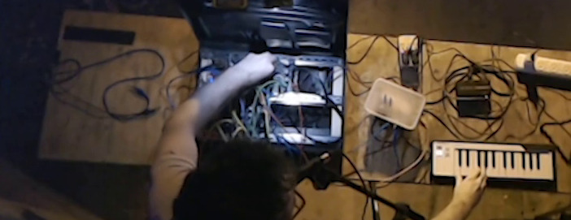

+++
title = "Purple Earth Hypothesis"
+++

# Purple Earth Hypothesis

Welcome to my DIY synthesizer website. Here are some of my projects. Stay tuned for updates!

## Modular Briefcase Synth

An analog modular synthesizer built into a briefcase. I made it during the
second half of 2024. It has 10 or so modules which can be patched using banana
jack test leads. There's a MIDI to control voltage adapter (in a takeaway
container!) which allows it to be controlled by a MIDI keyboard.

This is the first electronics project I've finished, though of course nothing is
truly ever finished. All the circuitry is made on stripboard. The hardest part
turned out to getting all the physical components to fit together.

[Here](https://youtu.be/dpt2oC0l_L0?si=J7vUAJJ4z86MYW4o)'s a video of this synth
in action.

## Combinatorial Audio Workstation (CAW)

[CAW](https://github.com/gridbugs/caw) is a software-defined modular
synthesizer which I've been developing since 2023. It's implemented as a Rust library allowing modules to be defined
and composed programatically. Patches can be static, where the synthesizer is a
program that you compile and run, _or_ patches can be dynamically built up in a
jupyter notebook. [Here](https://www.youtube.com/watch?v=vAAUqQbA4qs)'s an
example of using jupyter to incrementally write a patch for CAW.

CAW works on Windows, macOS, Linux, and [web
browsers](https://gridbugs.github.io/bevy-caw-experiment/).

In addition to
building instruments for live performance, CAW can be built into other projects
to generate sounds or music. I've used it in a couple of game jams
[here](https://gridbugs.itch.io/scope-creep) and
[here](https://gridbugs.itch.io/electric-organ).

There are a bunch of examples of CAW in action over on my
[youtube](https://www.youtube.com/@gridbugstv/videos). Here are some that I'm
particularly happy with:
- [Ear candy filter sweep to show off stereo
  oscillographics](https://www.youtube.com/watch?v=fArGverzl4A)
- [Intro to Dreams by Van Halen to show off the chorus
  module](https://www.youtube.com/watch?v=8OR7GkginNw)
- [Arpegiator demo](https://www.youtube.com/watch?v=PjnEx5cQ0oI)
- [Vocoder demo](https://www.youtube.com/watch?v=lwuXFWOIe1Y)
- [Bad Apple MIDI stress test](https://www.youtube.com/watch?v=0BZwpZHrmQM)
