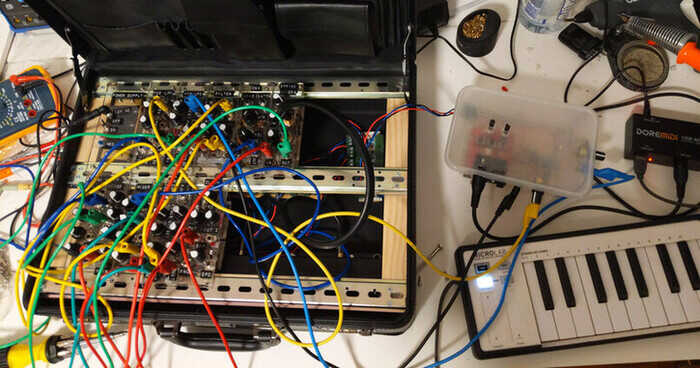
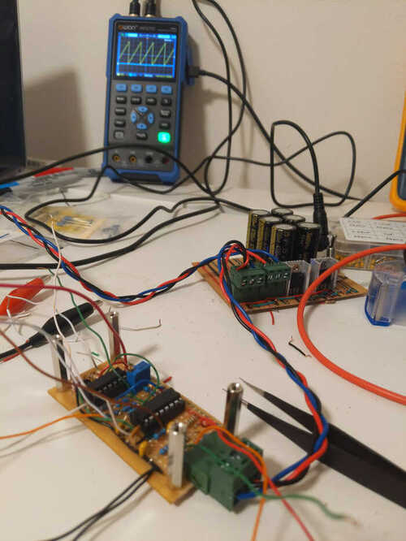
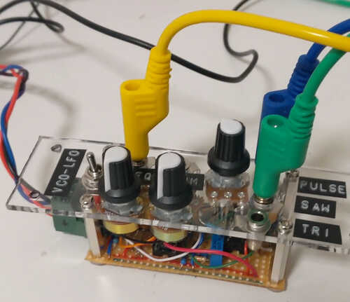
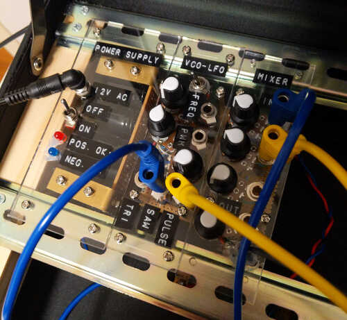
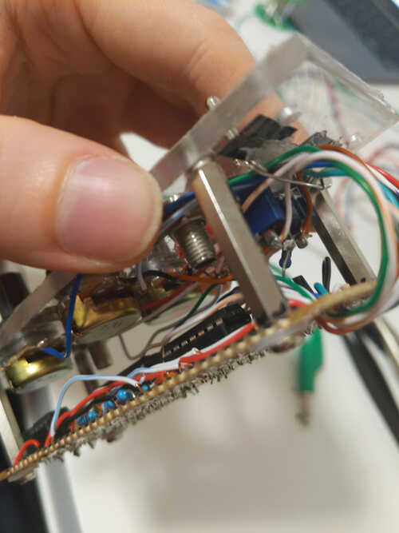
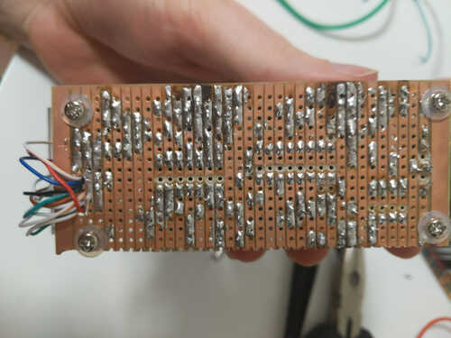
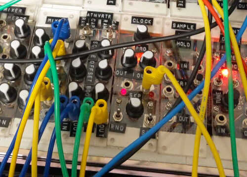

+++
title = "Briefcase Synth"
date = 2026-01-31
path = "briefcase-synth"

[taxonomies]
tags = ["project", "hardware"]

[extra]
og_image = "briefcase-synth.jpg"
+++

I made an analog modular synthesizer in a briefcase.

The circuitry is based on the [breadboard synthesizer](@/blog/breadboard-synth/index.md).
This was a hard project to get started because I had lots of arbitrary decisions to make about the physical construction.
I'd need to build a frame inside the briefcase that the modules would attach to, and the modules themselves would
need a front panel that somehow physically attaches to the circuit board and also to the case.

I bought some wood from a hardware store and some metal beams from ebay (I
think they're designed for server racks?) and cut everything to size with a
hacksaw. The shape of the metal beams made them hard to fasten to the wood
properly with screws so I ended up using some glue as well!

There's a metal beam at the back, middle, and front of the case, so there's room for
two rows of modules.

Here's the first module - an oscillator - part-way through construction. The
oscillator is in the foreground, and behind it is the power supply from the
breadboard synth. The briefcase synth uses the same power supply design but in
a form factor which fits in the briefcase.
The power cables are also a standard I established for the breadboard synth
using 3 pin connectors I found at my local electronics store, and braided wire
so it doesn't get tangled.

In the background there's an oscilloscope displaying the waveform produced by the oscillator.

For the module front panels I went with some clear acrylic I found at a
recycling store. It came in a strip whose width was slightly less than half the depth of
the briefcase, so I could make each front panel with a single cut.
I cut the acrylic with a hacksaw. Some of my cuts aren't perfectly straight.

Here's the oscillator with its front panel attached.

I made several trips to the hardware store to buy the different sized drill bits I needed.
Jack sockets, knobs, switches, and screws all need different hole sizes.

I iterated on ways to safely drill the holes without shattering the panel.
Originally I would start by drilling the corner screw holes, and using them to fasten the
panel to a block of sacrificial wood. This holds the panel in place while I drill the other
larger holes. To drill a larger hole, start by drilling a small hole and then use
several different drill bits to gradually widen it. Unfortunately this approach led to
several shattered front panels. When using a large drill bit, right after the bit
penetrates through the panel and starts drilling into the wood, the panel would sometimes be
violently pulled away from the wood, up the drill bit, occasionally causing it to shatter.

Eventually what I found to work was drilling the corner holes first as before, but then using them to bolt
the panel to the _frame_ inside the briefcase before drilling the remaining holes.

Here are the first three modules I completed attached to the frame. There's a power supply,
oscillator, and a mixer. The mixer has a headphone jack allowing speakers to be plugged in.
Modules connect to each other using banana jacks. Banana jacks are stackable, so a single
socket can be attached to multiple other sockets. These cables only have a single wire in them,
but modules all share the same ground reference through the power supply.

Here's a closeup of the internals of a module. You can see the spacers that attach the front panel
to the circuit board, and a cable management system I devised for the wires going from the front panel to the circuit.
Start by drilling a few holes in the circuit board and thread all the wires through them.
Hot glue a safety pin to the base of the front panel. The pin will be used to hold all the wires
in place, and it can be opened to allow new wires to be added.
Good cable management allows you to connect the front panel and board with long enough wires that the module can be "unfolded" to access the underside
of the front panel, without the long wires getting tangled.

And here's the underside of the circuit board showing the cable management hole and my dodgy soldering.
I made all the modules on stripboard. I took this photo during a troubleshooting session
where I'd de-soldered and re-soldered some components leading to the burnt traces.
When attaching ICs to stripboard it's necessary to cut the traces between their pins.
I drilled through the copper strip trying to not also drill all the way through the board.
Also make sure to use a non-conductive washer when attaching bolts to stripboard so the
head of the bolt doesn't short out the traces.

I spent several months making modules. Eventually I made a MIDI to analog voltage converter
allowing the synth to be controlled by MIDI keyboard.
It's the takeaway container in the image below.

One problem I encountered was that modules needed to be bolted onto the metal beams
in the case, but this required reaching under the beam to hold the nut while fastening
the bolt. It's only possible to reach the nuts of modules with empty space next to them
meaning that only the outer-most modules could ever be removed.

To fix this I replaced all the bolts with Command picture-hanging strips, which are
kind of like Velcro but they seem to hold tighter and don't wiggle at all. I initially
tried Velcro but found the picture-hanging strips worked better.

Here's a jam session I recorded with the synth:

<iframe width="560" height="315" src="https://www.youtube.com/embed/D77Rjtgv7kU?si=HhDTdoqaq3FOZCo6" title="YouTube video player" frameborder="0" allow="accelerometer; autoplay; clipboard-write; encrypted-media; gyroscope; picture-in-picture; web-share" referrerpolicy="strict-origin-when-cross-origin" allowfullscreen></iframe>

And here's a live performance I did with the synth at an electronic music open mic:

<iframe width="560" height="315" src="https://www.youtube.com/embed/dpt2oC0l_L0?si=tRvhVP0XQQeGMF8n" title="YouTube video player" frameborder="0" allow="accelerometer; autoplay; clipboard-write; encrypted-media; gyroscope; picture-in-picture; web-share" referrerpolicy="strict-origin-when-cross-origin" allowfullscreen></iframe>
