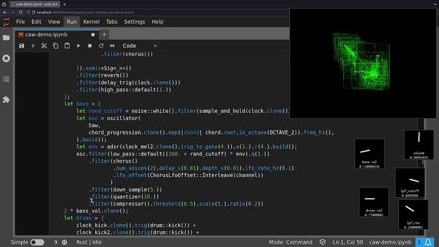

+++
title = "CAW (part 3): Live Coding with CAW"
date = 2026-02-11
path = "caw-part-3"
description = "Live Coding in Jupyter with a Rust Synthesizer Library"

[taxonomies]
tags = ["project", "software"]

[extra]
og_image = "screenshot.jpg"
+++

[CAW](https://github.com/gridbugs/caw) is a Rust library for making synthesizers.
This post is about using CAW to perform music live by writing code into a Jupyter notebook.

Previous posts about CAW:
- [CAW (part 1): A Rust library for making Synthesizers](@/blog/caw-part-1/index.md)
- [CAW (part 2): Optimizing CAW](@/blog/caw-part-2/index.md)


Live coding is a type of performance where music (or other art) is generated in
real time by writing and evaluating code. Dedicated programming languages exist
for live coding, such as [Tidal Cycles](https://tidalcycles.org), and performers
usually write code in an editor that's tightly integrated into the evaluation of the
program. If your program is generating music you want to be able to change the program
and have the change take effect without needing to restart the program.

The standard workflow for programming in Rust is to write code, then compile the code, then
run the resulting executable. If you change the code you need to restart the executable
for the change to become visible. The project [evcxr](https://github.com/evcxr/evcxr)
implements a Rust REPL where programs can be evaluated line by line, and a
[Rust Jupyter
Kernel](https://github.com/evcxr/evcxr/blob/main/evcxr_jupyter/README.md)
allowing Rust to be written into a Jupyter notebook.
Code in one cell can be rerun without needing to restart the entire program.



We need to approach defining synthesizers a little differently when writing them in Jupyter.
Take this simple program as an example which plays a sawtooth wave sweeping between 100Hz and 150Hz:
```rust
use caw::prelude::*;

fn signal() -> Sig<impl SigT<Item = f32>> {
    let lfo = oscillator(Saw, 0.5).build().signed_to_01();
    oscillator(Saw, 100.0 + (lfo * 50.0)).build()
}

fn main() {
    let player = Player::new().unwrap();
    let _handle = player.play_mono(signal(), Default::default()).unwrap();
    std::thread::park();
}
```

The standard way of writing CAW synthesizers is to create a top level signal
(usually by composing simpler signals) and then play it on a `Player`.
We could start by just copying this program into Jupyter:
```rust
// Cell 0:
:dep caw = { path = "/path/to/caw/source", features = ["player"] }

// Cell 1:
use caw::prelude::*;

// Cell 2:
fn signal() -> Sig<impl SigT<Item = f32>> {
    let lfo = oscillator(Saw, 0.5).build().signed_to_01();
    oscillator(Saw, 100.0 + (lfo * 5.0)).build()
}

fn main() {
    let player = Player::new().unwrap();
    let _handle = player.play_mono(signal(), Default::default()).unwrap();
    std::thread::park();
}

main();
```

Note the first cell where we tell evcxr about the notebook's external dependencies.
Also note the call to `main()`. Jupyter doesn't automatically call the `main` function, but allows
code to be written outside of functions which is run when the containing cell is evaluated.
With that in mind we can get rid of the entire `main` function and put its contents in the top level.
This also lets us get rid of the `std::thread::park()` previously required to stop `main()` from returning
immediately. The handle returned by `player.play_mono(...)` stays in scope in the notebook forever
so the sound will keep playing until the kernel is stopped.

```rust
// ...
// Cell 2:
fn signal() -> Sig<impl SigT<Item = f32>> {
    let lfo = oscillator(Saw, 0.5).build().signed_to_01();
    oscillator(Saw, 100.0 + (lfo * 50.0)).build()
}

let player = Player::new().unwrap();
let _handle = player.play_mono(signal(), Default::default()).unwrap();
```

This runs and we hear the frequency sweep. Say we want to change the base frequency from 100Hz
to 200Hz. If you update the code accordingly and the rerun the cell, not only will the base
frequency change but the sweep will reset to its start position. The entire state of the program
has been reset. This isn't ideal because if you're generating a looping melody and you change
some aspect of the melody, applying the change will cause the melody to restart from the beginning
of the loop. You could try to synchronize your changes with the start of the loop, but let's
find a better way to update running synthesizers without resetting their state.

First, a false start: Split the cell into two cells.
```rust
// ...
// Cell 2:
fn signal() -> Sig<impl SigT<Item = f32>> {
    let lfo = oscillator(Saw, 0.5).build().signed_to_01();
    oscillator(Saw, 100.0 + (lfo * 50.0)).build()
}

// Cell 3:
let player = Player::new().unwrap();
let _handle = player.play_mono(signal(), Default::default()).unwrap();
```

This might seem like it would fix the problem. The player is now only created once,
and updating the cell containing the definition of `signal` doesn't cause the signal
to be recreated. Unfortunately that's exactly the reason why updating the `signal` function
and re-evaluating its cell has _no effect_! All we've done is redefine the function, but
it hasn't been called yet, so nothing happens to the sound.

Instead we need a way of reaching into a signal and changing a value without
redefining or restarting the signal. To make this possible, CAW introduces a
new collection of types called `Cell`s. A `Cell` is a container which can store
a signal (an implementation of the `SigT` trait) inside it. A `Cell` is _also_
a signal, and it acts like the signal it contains, and has some extra methods
to allow replacing the stored signal with some new signal.

To allow the base frequency of the sweep to be dynamically changed, we'll replace the static `100.0`
in the code with a `Cell` defined globally, and then change the `Cell`'s value once the program
starts running. Rust functions aren't allowed to access variables defined in
external scopes (only constants and other functions), so we first need to take a
little detour to change the way the signal is defined. One option might be to just define the
signal globally rather than with a function, however a limitation of evcxr is that
type inference for global variables seems to struggle with functions returning `impl <Trait>`
which is very common in CAW. We could explicitly state the type:
```rust
let lfo: ... = oscillator(Saw, 0.5).build().signed_to_01();
let signal: ... = oscillator(Saw, 100.0 + (lfo * 50.0)).build();
```
...however unboxed signals tend to have very long types that reflect the types of all the simpler signals they are composed of. For example the type of `lfo` is:
```rust
Sig<SignedTo01<Oscillator<Saw, f32, f32, f32, bool>>>
```
and the type of `signal`:
```rust
Sig<Oscillator<Saw, Sig<OpScalarSig<f32, OpSigScalar<SignedTo01<Oscillator<Saw, f32, f32, f32, bool>>, f32>>>, f32, f32, bool>>
```

Instead, let's define the signal with a closure and capture the `Cell` variable
storing the base frequency. While we're at it, let's change how the player is
created to be more ergonomic for notebook programming. CAW has a `live_stereo` function
which creates a player and returns a `Cell` whose contents will be played. We can
update its contents with a signal to play that signal, and then later update its contents
with the signal `0.0` to silence the player. That way we no longer have to stop the entire
notebook to make the sound stop!

One change at a time. First, here's the notebook refactored to use `live_stereo`:
```rust
// Cell 0:
:dep caw = { path = "/path/to/caw/source", features = ["live"] }

// Cell 1:
use caw::prelude::*;

// Cell 2:
let out = live_stereo();

// Cell 3:
out.set(|| {
    let lfo = oscillator(Saw, 0.5).build().signed_to_01();
    oscillator(Saw, 100.0 + (lfo * 50.0)).build()
});
```

Then to replace the output signal with silence, run:
```rust
out.set(|| 0.0);
```

This uses the "live" feature which enables the `live_stereo` function.

Notice how the `set` method takes a closure which _returns_ a signal rather than just a signal.
That's because `out` is actually a _pair_ of `Cell`s corresponding to the left and right audio
channels. The `set` method calls the closure twice and sets the left and right `Cell` to the result
of the respective calls (there's also a `set_channel` method which passes the channel to the
closure for more control over stereo audio).

Now, to allow changing the base frequency of the sweep, update the definition of the sweep
to use a `Cell` for the base frequency:
```rust
// Cell 3:
let base_freq_hz = cell(100.0);
out.set(|| {
    let lfo = oscillator(Saw, 0.5).build().signed_to_01();
    oscillator(Saw, base_freq_hz.clone() + (lfo * 50.0)).build()
});
```

Now in a later cell, update the `base_freq_hz` value:
```rust
base_freq_hz.set(200.0);
```
...and the base frequency will change without affecting the timing of the sweep itself.

This time `set` just takes a signal, since `base_freq_hz` is a regular `Cell`.
`Cell`s can contain arbitrary signals - not just constant values - so we
could do something like:
```rust
base_freq_hz.set(100. + oscillator(Sine, 8.0).build() * 10.0);
```
...so that the base frequency is modulated by another low-frequency oscillator.

Or we could open a window with a knob allowing the base frequency to be tuned manually.
To enable this, update the dependencies in the first cell:
```rust
// Cell 0:
:dep caw = { path = "/path/to/caw/source", features = ["live", "widgets"] }
```

Then run:
```rust
base_freq_hz.set(knob("base freq").build() * 100.0);
```

Knobs by default yield values between 0 and 1, so multiply the knob by 100 to
allow tuning frequencies between 0Hz and 100Hz.

`Cell`s are how CAW allows synthesizer configurations to be dynamically changed in a running
notebook without resetting the synthesizer's state. They require some planning when defining
signals, as all the `Cell`s a signal will use must be declared ahead of time, and the broader
structure of a signal still can't be changed without resetting its state. Despite these constraints,
I'm still amazed that this works at all! I think of Rust as a static language with a big conceptual
gap between the code you write and the program that runs, and being able to change parts of a program
while the rest of the program continues running is awesome.

CAW's visualizations work in notebooks! To view a visualization of the waveform, update the cell with `live_stereo()` to:
```rust
// Cell 1:
let out = live_stereo_viz_udp(Default::default());
```
...and restart the notebook.

The function `live_stereo_viz_udp` gives a hint about how the visualization works.
CAW uses SDL2 for its visualization, and SDL2 needs to run from the main thread of the program.
There's no way to satisfy that constraint when opening a window from a notebook, so the only
way to have the notebook open a window is if it runs a new process and have that process use SDL2
to render the visualization on its main thread. But this means CAW running in the notebook needs to
be able to send the data to visualize to the new process, and CAW sends this data over a UDP socket.

While often used for communication
across computer networks, UDP works just fine as an inter-process communication protocol, and thanks
to its ubiquity as a transport layer protocol for the internet, it's implemented everywhere; I don't need
to find a separate IPC mechanism for Windows vs Unix machines.

Knobs are also rendered with SDL2 and each knob is a separate process which communicates with the CAW process
by sending MIDI commands over UDP sockets.
I didn't realize this at the time but it's actually quite common to use UDP as a transport
protocol for synthesizer software and hardware.

To use visualizations and widgets you'll need to have a pair of programs installed somewhere in your
`PATH`: [caw_viz_udp_app](https://crates.io/crates/caw_viz_udp_app) and [caw_midi_udp_widgets_app](https://crates.io/crates/caw_midi_udp_widgets_app).

E.g., run:
```
$ cargo install caw_viz_udp_app caw_midi_udp_widgets_app
```
These are the programs that CAW will run when opening visualization or knob windows.

There's a Nix project [here](https://github.com/gridbugs/caw-notebooks) that
sets up all the necessary dependencies for using CAW in a Jupyter notebook. You'll
also need a local checkout of [CAW](https://github.com/gridbugs/caw) itself to point to
intead of `"/path/to/caw/source"` in the code snippets on this page.

Here's a video of a jam session with CAW in a Jupyter notebook:

<iframe width="560" height="315" src="https://www.youtube.com/embed/vAAUqQbA4qs?si=sRShkiAMBJvDug0r" title="YouTube video player" frameborder="0" allow="accelerometer; autoplay; clipboard-write; encrypted-media; gyroscope; picture-in-picture; web-share" referrerpolicy="strict-origin-when-cross-origin" allowfullscreen></iframe>
