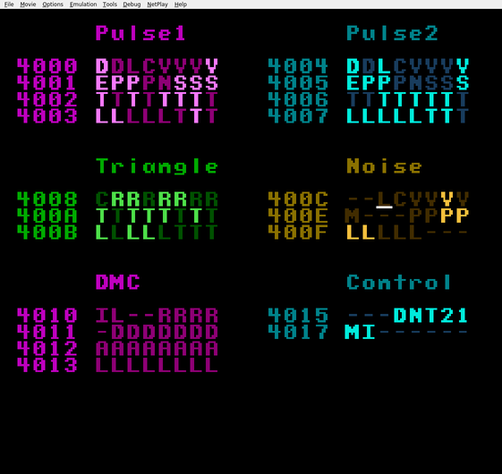

+++
title = "NES Audio Playground"
date = 2026-01-01
path = "nes-audio-playground"

[taxonomies]
tags = ["project", "software", "hardware"]

[extra]
og_image = "screenshot.png"
+++

Starting out the year with a series of posts about my past synth projects.

My obsession with synthesizers grew out of an interest in emulating old game consoles.
I made an [emulator](https://github.com/gridbugs/mos6502) for the Nintendo Entertainment System
as my first project back in 2019, but I never bothered to emulate the sound chip.
A couple of years ago I decided to have a go at adding sound to my emulator, and not knowing much about audio
the first thing I did was write some test programs for the NES to play sound on other people's emulators.

This post is about the last such program I wrote - a musical instrument in its own right -
which indirectly started the side quest which quickly became my main quest: DIY synthesizers.

I never did get around to adding sound to my emulator.

The NES audio output is a mix of five instruments: a pair of pulse (square) waves, a triangle wave, a noise generator,
and the DMC which allows playing audio samples (though the limited memory of the NES means
the samples tend to be quite short).

The NES sound chip (or APU) is controlled with 20 memory-mapped 8-bit registers.
My audio playground is intended as a tool for getting familiar with the function of
each bit of each register by showing each one on the screen and letting you use a game
controller to flip them between 0 and 1.

The playground's UI lists each bit of each register, with registers organized by instrument.
Light bits are set to 1 and dark bits are set to 0.
Bits are represented by a letter intended to serve as a mnemonic for the bits
function, and bits represented by dashes have no function.
Use the direction buttons to move the cursor and press A to flip the bit under the cursor.
You can "buffer" changes to bits by holding down the B button while flipping bits with A,
and when you release B all the changes are applied at once.

This is based on a video I saw of a similar tool called [livenes](https://ploguechipsounds.blogspot.com/2014/09/plogue-livenes.html).

[Here's a link to download the ROM file for my audio playground.](nes-audio-playground.nes)

While thinking about how to make it easier to perform real music with a tool like this
I came across [trackers](https://en.wikipedia.org/wiki/Music_tracker),
which then led me to [this video by Look Mum No Computer](https://youtu.be/5qE-WJzdd6k)
about using a tracker to play music on a NES.
Then I watched all his other videos and now I make synthesizers as a hobby.

Further reading:
 - [Short jam on the NES audio playground](https://youtu.be/Y-y84Th9_-Q)
 - [The project on github](https://github.com/gridbugs/nes-audio-playground)
 - [My talk at Sydney Rust meetup about developing this project](https://youtu.be/hs-MrEoOX5Y)
 - [Post on my other blog about playing audio on the NES](https://www.gridbugs.org/playing-sound-on-the-nes-by-directly-setting-its-dmc-output/)
 - [NES sound chip documentation](https://www.nesdev.org/wiki/APU)
